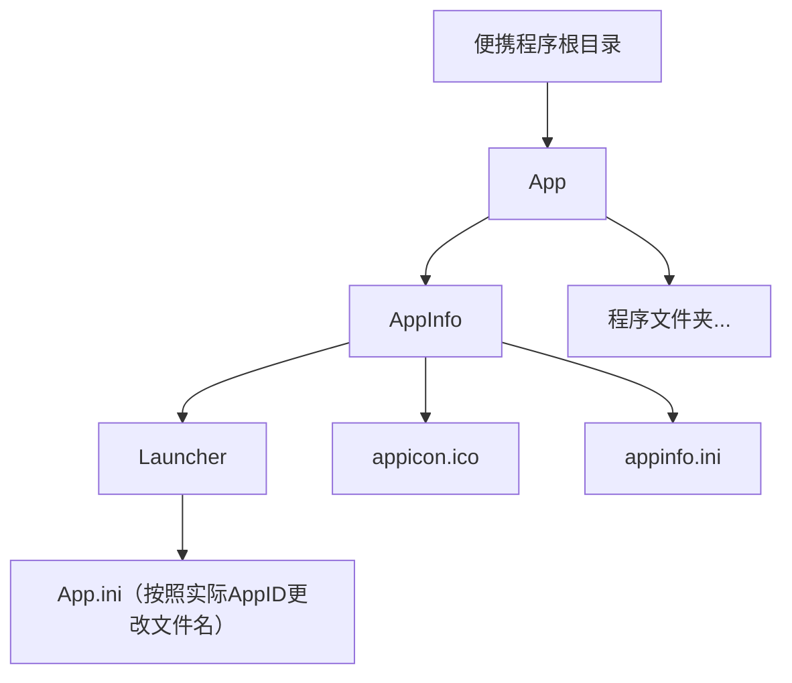

---
routeMeta:
  itemTitle: PortableApps
  itemDesc: 便携应用制作器
  itemIcon: portableapps.com
---
# PortableApps:便携应用制作器
## 安装教程
访问[PortableApps](https://portableapps.com/development)官网，下载[PortableAppsLauncher](https://download2.portableapps.com/portableapps/PortableApps.comLauncher/PortableApps.comLauncher_2.2.9.paf.exe)启动程序生成器

参照配置模板制作，可使用[Total Uninstall](https://www.martau.com/zh-CN/)辅助记录软件安装包对系统的所有修改，并按照目录摆放配置文件


将`PortableApps.comLauncher.paf.exe`安装在任意位置，打开`PortableApps.comLauncherGenerator.exe`，选择整个便携程序根目录，根据指示完成启动器生成

## 配置模板
### Adobe Audition
```ini title="appinfo.ini"
[Details]
Name=Adobe Audition
AppID=AuditionPortable

[Control]
Icons=1
Start=AuditionPortable.exe
```
```ini title="AuditionPortable.ini"
[Launch]
ProgramExecutable=Program Files\Adobe\Adobe Audition 2026\Adobe Audition.exe
SinglePortableAppInstance=true
DirectoryMoveOK=yes

[Activate]    
Registry=true
XML=true

[RegistryKeys]
Audition=HKCU\SOFTWARE\Adobe\Audition
Common 26.0=HKCU\SOFTWARE\Adobe\Common 26.0
CommonFiles=HKCU\SOFTWARE\Adobe\CommonFiles
CSXS.12=HKCU\SOFTWARE\Adobe\CSXS.12
IAC=HKCU\SOFTWARE\Adobe\IAC

[RegistryCleanupIfEmpty]
1=HKCU\SOFTWARE\Adobe

[FilesMove]
Roaming\Adobe\dvaAnalyticsID.dat=%APPDATA%\Adobe
Roaming\Adobe\dvaAnalyticsPS.dat=%APPDATA%\Adobe
Public\Documents\Plugin Loading.log=%HOMEDRIVE%\Users\Public\Documents

[DirectoriesMove]
Local\Adobe\licflags=%LOCALAPPDATA%\Adobe\licflags
Local\Adobe\NGL=%LOCALAPPDATA%\Adobe\NGL
Local\Adobe\OOBE=%LOCALAPPDATA%\Adobe\OOBE
Local\CEF\User Data\Dictionaries=%LOCALAPPDATA%\CEF\User Data\Dictionaries
Public\Documents\Adobe\Audition\26.0\Session Templates=%HOMEDRIVE%\Users\Public\Documents\Adobe\Audition\26.0\Session Templates
Public\Documents\Media Cache=%HOMEDRIVE%\Users\Public\Documents\Media Cache
Public\Documents\Media Cache Files=%HOMEDRIVE%\Users\Public\Documents\Media Cache Files
Roaming\Adobe\Audition=%APPDATA%\Adobe\Audition
Roaming\Adobe\Common=%APPDATA%\Adobe\Common
Roaming\Adobe\HelpCfg=%APPDATA%\Adobe\HelpCfg
Roaming\Adobe\dynamiclinkmanager=%APPDATA%\Adobe\dynamiclinkmanager
Roaming\com.adobe.dunamis=%APPDATA%\com.adobe.dunamis
Roaming\Microsoft\SystemCertificates\My\Certificates=%APPDATA%\Microsoft\SystemCertificates\My\Certificates

[DirectoriesCleanupIfEmpty]
1=%LOCALAPPDATA%\Adobe
2=%LOCALAPPDATA%\CEF\User Data
3=%LOCALAPPDATA%\CEF
4=%HOMEDRIVE%\Users\Public\Documents\Adobe\Audition\26.0
5=%HOMEDRIVE%\Users\Public\Documents\Adobe\Audition
6=%HOMEDRIVE%\Users\Public\Documents\Adobe
7=%PAL:DataDir%\Local\CEF\User Data\Dictionaries
8=%PAL:DataDir%\Local\CEF\User Data
9=%PAL:DataDir%\Local\CEF
10=%PAL:DataDir%\Local\Adobe\licflags
11=%PAL:DataDir%\Local\Adobe\OOBE
12=%PAL:DataDir%\Local\Adobe
13=%PAL:DataDir%\Local
```
### Adobe Photoshop
```ini title="appinfo.ini"
[Details]
Name=Adobe Photoshop
AppID=PhotoshopPortable

[Control]
Icons=1
Start=PhotoshopPortable.exe
```
```ini title="PhotoshopPortable.ini"
[Launch]
ProgramExecutable=Program Files\Adobe\Adobe Photoshop 2025\Photoshop.exe
SinglePortableAppInstance=true
RunAsAdmin=compile-force
DirectoryMoveOK=yes

[Environment]
CommonProgramFiles=%PAL:AppDir%\Program Files\Common Files
CommonProgramFiles(x86)=%PAL:AppDir%\Program Files (x86)\Common Files
CommonProgramW6432=%PAL:AppDir%\Program Files\Common Files

[Activate]    
Registry=true
XML=true

[RegistryKeys]
Camera Raw=HKCU\SOFTWARE\Adobe\Camera Raw
CommonFiles=HKCU\SOFTWARE\Adobe\CommonFiles
Dunamis=HKCU\SOFTWARE\Adobe\Dunamis
CSXS.12=HKCU\SOFTWARE\Adobe\CSXS.12
Edge=HKCU\SOFTWARE\Edge
EdgeWebView=HKCU\SOFTWARE\Microsoft\EdgeWebView
IAC=HKCU\SOFTWARE\Adobe\IAC
MediaBrowser=HKCU\SOFTWARE\Adobe\MediaBrowser
Photoshop=HKCU\SOFTWARE\Adobe\Photoshop
-=HKCU\SOFTWARE\Microsoft\Windows\CurrentVersion\Explorer\FileExts\.jpg\OpenWithList
-=HKCU\SOFTWARE\Microsoft\Windows\CurrentVersion\Explorer\FileExts\.psb
-=HKCU\SOFTWARE\Microsoft\Windows\CurrentVersion\Explorer\FileExts\.psd
-=HKCU\SOFTWARE\Microsoft\Windows\CurrentVersion\Explorer\FileExts\.psdc
-=HKCU\SOFTWARE\Microsoft\Windows\CurrentVersion\Explorer\FileExts\.psdt
-=HKLM\SOFTWARE\Classes\.psb
-=HKLM\SOFTWARE\Classes\.psdc
-=HKLM\SOFTWARE\Classes\.psdt
-=HKLM\SOFTWARE\Classes\adbps
-=HKLM\SOFTWARE\Classes\Photoshop.Application
-=HKLM\SOFTWARE\Classes\Photoshop.Application.190
-=HKLM\SOFTWARE\Classes\Photoshop.Application.190.1
-=HKLM\SOFTWARE\Classes\Photoshop.Image
-=HKLM\SOFTWARE\Classes\Photoshop.Image.26
-=HKLM\SOFTWARE\Classes\Photoshop.PlugIn

[DirectoriesMove]
Documents\Adobe=%DOCUMENTS%\Adobe
Local\Adobe\CameraRaw=%LOCALAPPDATA%\Adobe\CameraRaw
Local\Adobe\Color=%LOCALAPPDATA%\Adobe\Color
Local\Adobe\licflags=%LOCALAPPDATA%\Adobe\licflags
Local\Adobe\NGL=%LOCALAPPDATA%\Adobe\NGL
Local\Adobe\OOBE=%LOCALAPPDATA%\Adobe\OOBE
Local\CEF\User Data\Dictionaries=%LOCALAPPDATA%\CEF\User Data\Dictionaries
Roaming\Adobe\Adobe PDF=%APPDATA%\Adobe\Adobe PDF
Roaming\Adobe\Adobe Photoshop 2025=%APPDATA%\Adobe\Adobe Photoshop 2025
Roaming\Adobe\CameraRaw=%APPDATA%\Adobe\CameraRaw
Roaming\Adobe\CCX Welcome=%APPDATA%\Adobe\CCX Welcome
Roaming\Adobe\Color=%APPDATA%\Adobe\Color
Roaming\Adobe\PS=%APPDATA%\Adobe\PS
Roaming\Adobe\Sonar=%APPDATA%\Adobe\Sonar
Roaming\Adobe\typequest=%APPDATA%\Adobe\typequest
Roaming\com.adobe.dunamis=%APPDATA%\com.adobe.dunamis
-=%LOCALAPPDATA%\D3DSCache
-=%APPDATA%\substanceconnectoropentcp
-=%APPDATA%\Microsoft\Crypto\RSA
-=%APPDATA%\Microsoft\SystemCertificates\My\Certificates

[FileWrite1]
Type=Replace
File=%PAL:DataDir%\settings\190.0.reg
Find=%PAL:LastDrive%%PAL:LastPackagePartialDir:DoubleBackslash%\\
Replace=%PAL:Drive%%PAL:PackagePartialDir:DoubleBackslash%\\

[FileWrite2]
Type=Replace
File=%PAL:DataDir%\settings\190.0.reg
Find=%PAL:LastPortableAppsBaseDir:DoubleBackslash%\\
Replace=%PAL:PortableAppsBaseDir:DoubleBackslash%\\

[FileWrite3]
Type=Replace
File=%PAL:DataDir%\settings\190.0.reg
Find=%PAL:LastDrive%\\
Replace=%PAL:Drive%\\
```